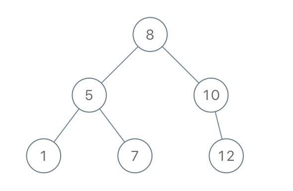

##   Construct Binary Search Tree from Preorder Traversal

Return the root node of a binary search tree that matches the given preorder traversal.

(Recall that a binary search tree is a binary tree where for every node, any descendant of node.left has a value < node.val, and any descendant of node.right has a value > node.val.  Also recall that a preorder traversal displays the value of the node first, then traverses node.left, then traverses node.right.)

 

__Example 1:__

```
Input: [8,5,1,7,10,12]
Output: [8,5,10,1,7,null,12]
```


---

## SOLUTION

```python
# Definition for a binary tree node.
# class TreeNode:
#     def __init__(self, x):
#         self.val = x
#         self.left = None
#         self.right = None

class Solution:
    def bstFromPreorder(self, preorder: List[int]) -> TreeNode:
        if not preorder: return
        root = TreeNode(preorder[0])
        i = 1
        while i < len(preorder) and preorder[i] < root.val:
            i += 1
        root.left = self.bstFromPreorder(preorder[1:i])
        root.right = self.bstFromPreorder(preorder[i:])
        return root
```

---

## ALGO

1. Construct the root node of the BST which would be the first item in the preorder sequence.

2. Find index i in the sequence which is greater than the root node

3. Recur for the left sub-tree which is the sequence after root and till index i

4. Recur for the right sub-tree which is the sequence after index i
