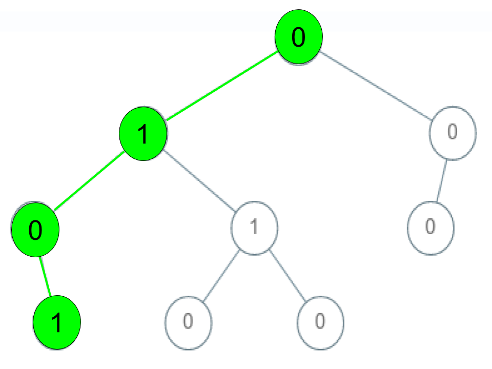

## Check If a String Is a Valid Sequence from Root to Leaves Path in a Binary Tree

Given a binary tree where each path going from the root to any leaf form a valid sequence, check if a given string is a valid sequence in such binary tree. 

We get the given string from the concatenation of an array of integers arr and the concatenation of all values of the nodes along a path results in a sequence in the given binary tree.

__Example 1:__

<!--  -->


```
Input: root = [0,1,0,0,1,0,null,null,1,0,0], arr = [0,1,0,1]
Output: true
Explanation: 
The path 0 -> 1 -> 0 -> 1 is a valid sequence (green color in the figure).
```

__Example 2:__


```
Input: root = [0,1,0,0,1,0,null,null,1,0,0], arr = [0,0,1]
Output: false 
Explanation: The path 0 -> 0 -> 1 does not exist, therefore it is not even a sequence.
```

__Example 3:__


```
Input: root = [0,1,0,0,1,0,null,null,1,0,0], arr = [0,1,1]
Output: false
Explanation: The path 0 -> 1 -> 1 is a sequence, but it is not a valid sequence.
```

__Constraints:__

* 1 <= arr.length <= 5000
* 0 <= arr[i] <= 9
* Each node's value is between [0 - 9].

---

## SOLUTION

```python
# Definition for a binary tree node.
# class TreeNode:
#     def __init__(self, val=0, left=None, right=None):
#         self.val = val
#         self.left = left
#         self.right = right
class Solution:
    def isValidSequence(self, root: TreeNode, arr: List[int]) -> bool:
        l = len(arr)
        i = 0
        return self.dfs(root, arr, l, i)
    
    def dfs(self, root, arr, l, i):
        # handle no tree condition
        if root is None:
            return l==0
        # handle leaf condition (i.e if last arr index and left node and node = arr[last])
        if (i == l-1) and (root.left == None and root.right == None) and arr[i] == root.val:
            return True
        if i < l and root.val==arr[i]:
            return self.dfs(root.left, arr, l, i+1) or self.dfs(root.right, arr, l, i+1)
        return False
```

Useful Link:

https://www.youtube.com/watch?v=_Es-FEkjKmA

